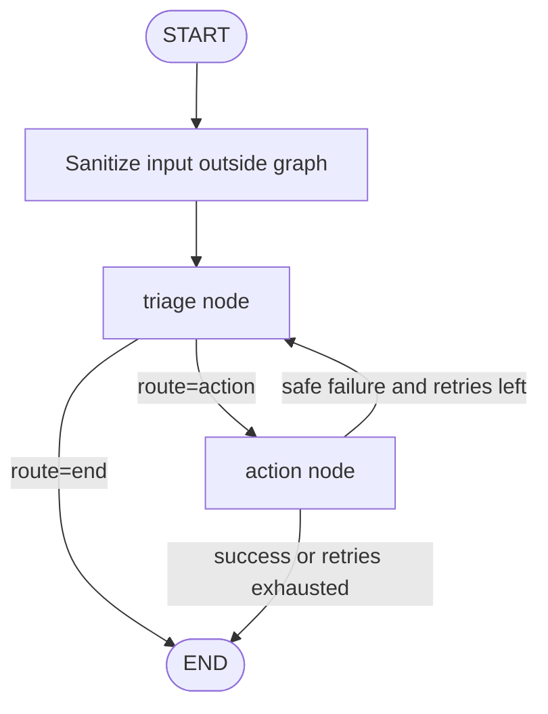

# AgIA

Mis agentes de inteligencia artificial.

---

## SECCIÓN 1: IMPLEMENTACIÓN DEL CÓDIGO (Production-Ready)

La implementación ejecutable solicitada está en `app_multi_agent.py`.

### Componentes entregados

- `app_multi_agent.py`: grafo multi-agente local con LangGraph `StateGraph`, `MemorySaver`, tipado estricto con `TypedDict` + Pydantic v2, integración con Ollama (`llama3.1`) y tool calling seguro.
- `pyproject.toml`: metadatos mínimos del proyecto y dependencias exactas para Python 3.11+.
- `Dockerfile`, `.dockerignore` y `docker-compose.yml`: empaquetado y orquestación local para ejecutar la aplicación en contenedores con Ollama.

### Capacidades implementadas

- Agente Analista (`triage`): analiza entrada saneada, extrae `cve_id`, `asset_ip`, severidad y estrategia de mitigación.
- Agente Ejecutor (`action`): usa tool calling sobre un conjunto explícitamente permitido para simular una remediación sandboxed.
- Resiliencia: `recursion_limit=10`, `try/except` en todos los nodos y ciclo de reintento controlado `action -> triage`.
- Seguridad: sanitización estricta previa al grafo, validación de CVE/IP, herramientas de mínimo privilegio y bloqueo de ejecución arbitraria.
- Operación local: flujo principal con Ollama y fallback determinista cuando Ollama no está disponible, lo que facilita pruebas y depuración sin romper la arquitectura objetivo.
- Operación en contenedor: imagen Docker no-root y composición local con servicio Ollama dedicado.

---

## SECCIÓN 2: DOCUMENTACIÓN TÉCNICA Y DE MANTENIMIENTO

### Arquitectura del Grafo

El sistema usa un `StateGraph` con un estado compartido `AgentState` persistido mediante `MemorySaver` por `thread_id`. La distribución operativa ahora contempla dos modos: ejecución local con Python y ejecución en contenedor mediante Docker/Docker Compose.

#### Nodos

1. **`triage`**
   - Entrada: `sanitized_input`, `errors` previos y `messages`.
   - Responsabilidad: producir un `TriageDecision` tipado con CVE, IP, severidad, estrategia, racional y decisión de actuar o finalizar.
   - Protección: ignora instrucciones embebidas en el input porque solo consume la versión saneada del reporte.

2. **`action`**
   - Entrada: `triage_plan`.
   - Responsabilidad: invocar un modelo Ollama con herramientas permitidas o, si el modelo no está disponible, ejecutar una simulación determinista equivalente.
   - Protección: solo puede resolver nombres presentes en `ToolRegistry`; no existe acceso genérico a shell ni a red desde la herramienta.

#### Aristas dirigidas

- `START -> triage`
- `triage -> action` cuando `route == "action"`
- `triage -> END` cuando la evidencia es insuficiente o se detecta una condición segura de finalización
- `action -> triage` cuando hay fallo seguro y aún queda un intento de retriage
- `action -> END` cuando la acción termina o se consume el presupuesto de reintentos

#### Ciclo de retroalimentación

El bucle `action -> triage` solo se activa cuando la ejecución falla de forma segura y `triage_attempts < 2`. Esto limita el coste computacional y evita loops infinitos incluso antes de aplicar `recursion_limit=10`.

### Diagrama del Flujo de Estados (Mermaid)



### Guía de Depuración (Debugging)

#### 1. Interceptar el estado en tiempo de ejecución

Ejecuta el script con logs detallados:

```bash
python app_multi_agent.py --log-level DEBUG --show-history
```

Qué revisar:

- `=== Final State ===`: snapshot serializado del estado final.
- `=== Latest Checkpoint ===`: próximo nodo y `status` persistidos por LangGraph.
- `=== Checkpoint History ===`: historial de checkpoints asociado al `thread_id`.

#### 2. Inspeccionar checkpoints de LangGraph

El script usa:

```python
config = {"configurable": {"thread_id": args.thread_id}, "recursion_limit": 10}
checkpoint = graph.get_state(config)
history = graph.get_state_history(config)
```

Esto permite auditar:

- `checkpoint.values["triage_plan"]`
- `checkpoint.values["action_report"]`
- `checkpoint.values["errors"]`
- `checkpoint.next`

#### 3. Auditar historial de mensajes

El campo `messages` usa `Annotated[list[BaseMessage], add_messages]`, por lo que conserva los mensajes humanos y de IA agregados por cada nodo. Para inspeccionarlos en una sesión Python:

```python
state = graph.get_state(config)
for message in state.values["messages"]:
    print(type(message).__name__, message.content)
```

#### 4. Auditar decisiones del LLM

- **Triage**: revisar `triage_plan`, especialmente `strategy`, `rationale`, `requires_action` y `confidence`.
- **Action**: revisar `action_report.executed_tool`, `commands` y `used_fallback`.
- Si `used_fallback=True`, el sistema no obtuvo respuesta operativa de Ollama y ejecutó la ruta determinista segura.

### Consideraciones de Seguridad

#### Protocolo para añadir nuevas herramientas al Action Agent

1. Definir una nueva herramienta con `@tool` y contrato de entrada explícito.
2. Validar todos los argumentos con Pydantic v2 antes de cualquier efecto lateral.
3. Limitar la herramienta a una única responsabilidad operativa.
4. Registrar la herramienta en `ToolRegistry`.
5. No exponer shell, `subprocess`, acceso arbitrario a archivos ni llamadas de red sin un sandbox independiente y listas allowlist.
6. Mantener `tool_choice="auto"` sobre un conjunto pequeño y aprobado de herramientas.

#### Mitigaciones contra prompts maliciosos

- La entrada se normaliza con `unicodedata.normalize`.
- Se eliminan caracteres de control y pseudo-etiquetas de rol (`<system>`, `<assistant>`, etc.).
- Se redactan patrones clásicos de prompt injection (`ignore previous instructions`, `reveal system prompt`, `developer mode`, `tool:`).
- Los nodos nunca consumen el input bruto; solo `sanitized_input`.
- El Action Agent no puede alterar directamente el estado: solo devuelve salidas estructuradas que el nodo traduce a actualizaciones controladas.

---

## SECCIÓN 3: MANUAL DE USO Y OPERACIÓN (Runbook)

### Requisitos del Sistema

- Python 3.11+ para ejecución local
- Docker Engine 24+ y Docker Compose v2 para ejecución en contenedores
- Ollama instalado localmente o un contenedor `ollama/ollama`
- Modelo local `llama3.1`

#### Levantar Ollama localmente

Instalación típica en Linux:

```bash
curl -fsSL https://ollama.com/install.sh | sh
```

Arranque del servicio:

```bash
ollama serve
```

Descarga del modelo:

```bash
ollama pull llama3.1
```

Variables de entorno recomendadas:

```bash
export OLLAMA_HOST=http://127.0.0.1:11434
export OLLAMA_MODEL=llama3.1
export LOG_LEVEL=INFO
```

### Guía de Instalación

#### Instalación local con `venv`

```bash
cd /home/runner/work/AgIA/AgIA
python3.11 -m venv .venv
source .venv/bin/activate
python -m pip install --upgrade pip
python -m pip install -e .
```

#### Construcción de la imagen Docker

```bash
cd /home/runner/work/AgIA/AgIA
docker build -t agia-multi-agent:latest .
```

### Guía de Ejecución

#### Ejecución rápida con el prompt de demostración embebido

```bash
python app_multi_agent.py --show-history
```

#### Ejecución con payload explícito

```bash
python app_multi_agent.py \
  --input "Critical audit finding: CVE-2025-1337 detected on 10.20.30.40 after patch drift analysis." \
  --thread-id incident-001 \
  --show-history
```
#### Ejecución con Docker usando Ollama en el host

1. Arranca Ollama en tu máquina host y descarga el modelo:

```bash
ollama serve
ollama pull llama3.1
```

2. Ejecuta el contenedor de la aplicación contra el servicio Ollama del host:

```bash
docker run --rm \
  --add-host=host.docker.internal:host-gateway \
  -e OLLAMA_HOST=http://host.docker.internal:11434 \
  -e OLLAMA_MODEL=llama3.1 \
  agia-multi-agent:latest \
  --input "Critical audit finding: CVE-2025-1337 detected on 10.20.30.40 after patch drift analysis." \
  --thread-id docker-host-001 \
  --show-history
```

#### Ejecución con Docker Compose (app + Ollama)

1. Levanta el servicio de Ollama:

```bash
docker compose up -d ollama
```

2. Descarga el modelo dentro del contenedor de Ollama:

```bash
docker compose exec ollama ollama pull llama3.1
```

3. Ejecuta el agente dentro del contenedor de aplicación:

```bash
docker compose run --rm agia \
  --input "Critical audit finding: CVE-2025-1337 detected on 10.20.30.40 after patch drift analysis." \
  --thread-id compose-001 \
  --show-history
```

4. Cuando termines, apaga los servicios y conserva el volumen del modelo para futuros arranques:

```bash
docker compose down
```


#### Payload esperado

Texto libre con evidencia operativa, idealmente incluyendo:

- Identificador CVE: `CVE-AAAA-NNNN`
- IP del activo afectado
- Indicadores de severidad (`critical`, `high`, `medium`, `low`)
- Contexto corto del incidente o auditoría

#### Payloads esperados en Docker

Los mismos payloads de texto libre aplican tanto en local como en contenedor. En Docker, pasa los argumentos después del nombre del servicio o de la imagen, por ejemplo `docker compose run --rm agia --input "..."` o `docker run ... agia-multi-agent:latest --input "..."`.

#### Cómo interpretar los logs de salida

1. **Bloque `Final State`**
   - `sanitized_input`: entrada que realmente consumió el grafo.
   - `triage_plan`: decisión estructurada del Agente Analista.
   - `action_report`: resultado del Agente Ejecutor.
   - `status`: estado terminal del flujo.

2. **Bloque `Latest Checkpoint`**
   - `next=()`: el grafo terminó.
   - `status=completed`: la simulación se resolvió correctamente.
   - `status=error`: hubo un fallo seguro o un input inválido.

3. **Bloque `Checkpoint History`**
   - Permite seguir el orden real de transición entre nodos.
   - Si aparece un retorno a `triage`, el sistema agotó una ruta de ejecución y lanzó un retriage controlado.

4. **Mensajes de conectividad con Ollama**
   - Si aparece `Ollama triage unavailable` o `Ollama action execution unavailable`, el sistema no pudo alcanzar el endpoint configurado en `OLLAMA_HOST`.
   - En ese caso, el flujo sigue siendo seguro porque entra en modo fallback determinista, pero no habrá decisión asistida por el LLM local.

### Ejemplos de prompts útiles

- `Critical vulnerability report: CVE-2025-1337 detected on asset 10.20.30.40 after an audit scan.`
- `High severity finding on 172.16.1.15 related to CVE-2024-3094; propose the safest remediation sequence.`
- `Audit log without IP address for CVE-2025-9999; decide whether execution should be blocked.`
