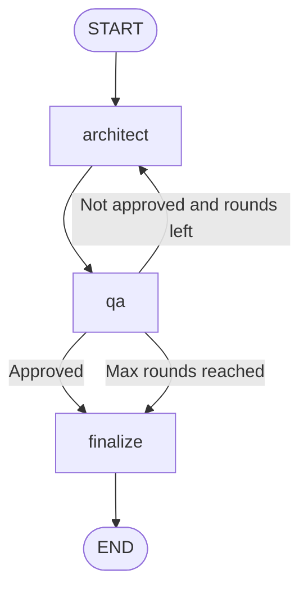

# Architecture

The pack executes a two-agent debate loop in LangGraph and produces one master technical document in Markdown.

## State

`DebateState` contains:

| Field | Type | Description |
|---|---|---|
| `business_requirement` | `str` | Input requirement from the operator |
| `messages` | `list[BaseMessage]` | Debate conversation history |
| `round_number` | `int` | Completed QA review rounds |
| `max_rounds` | `int` | Hard cap for debate iterations (max 3) |
| `architect_proposal` | `str` | Latest architecture proposal |
| `qa_review` | `str` | Latest QA review |
| `qa_approved` | `bool` | Approval gate from QA |
| `review_log` | `list[dict]` | Round-by-round debate artifact |
| `final_document` | `str` | Unified final architecture specification |
| `errors` | `list[str]` | Non-fatal fallback warnings |

## Debate and consensus cycle

1. `architect` generates proposal `n` using the business requirement and latest QA feedback.
2. `qa` audits proposal `n`, returning risks, data model, and approval status.
3. The graph loops back to `architect` while `qa_approved=False` and `round_number < max_rounds`.
4. The graph ends only when QA approves or `round_number == max_rounds` (maximum 3 rounds).
5. `finalize` composes one structured Markdown master document.

## Edges

```text
START -> architect
architect -> qa
qa -> architect   (when qa_approved=false and round_number < max_rounds)
qa -> finalize    (when qa_approved=true or round_number >= max_rounds)
finalize -> END
```

## Workflow diagram (Mermaid)


