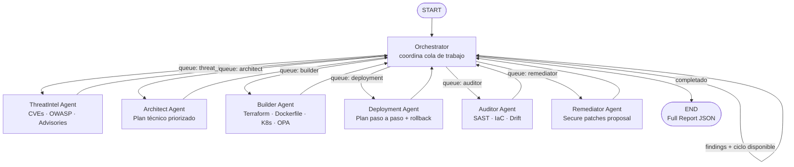

# Architecture

## Estado compartido (`AgentState`)

`AgentState` es el contrato central del grafo. Todos los agentes leen y escriben campos acotados.

| Campo | Tipo | Propietario escritura |
|---|---|---|
| `target_dir` | `str` | Inicializado por usuario |
| `context` | `str` | Inicializado por usuario |
| `threat_intel` | `list[dict]` | ThreatIntel Agent |
| `arch_plan` | `list[dict]` | Architect Agent |
| `build_proposals` | `list[dict]` | Builder Agent |
| `deployment_plan` | `list[dict]` | Deployment Agent |
| `audit_findings` | `list[dict]` | Auditor Agent |
| `patches` | `list[dict]` | Remediator Agent |
| `workflow_queue` | `list[str]` | Orchestrator + cada agente (pop) |
| `cycle` | `int` | Orchestrator |
| `messages` | `list[BaseMessage]` | Todos (append-only) |
| `errors` | `list[str]` | Todos (append) |
| `status` | `str` | Orchestrator |

## Topología del grafo

El grafo usa un modelo **hub-and-spoke con cola de trabajo**:

- El `Orchestrator` actúa como hub: decide el siguiente agente leyendo `workflow_queue`.
- Cada agente specialist es un spoke que se conecta al Orchestrator después de completar su tarea.
- La `workflow_queue` es una lista ordenada de agentes pendientes; cada agente se elimina al ejecutarse.
- Al agotar la cola, el Orchestrator decide si iniciar un nuevo ciclo o finalizar.

## Flujo de ejecución

```
START
  → orchestrator          (evalúa workflow_queue, decide next o completed)
  → threat_intel          (investiga CVEs y amenazas, escribe threat_intel)
  → orchestrator
  → architect             (genera arch_plan a partir de threat_intel)
  → orchestrator
  → builder               (genera build_proposals a partir de arch_plan)
  → orchestrator
  → deployment            (genera deployment_plan a partir de build_proposals)
  → orchestrator
  → auditor               (escanea target_dir, escribe audit_findings)
  → orchestrator
  → remediator            (propone patches a partir de audit_findings)
  → orchestrator          (si ciclo < MAX_CYCLES y hay findings → nuevo ciclo)
  → END
```

## Diagrama Mermaid.js



## Ciclos de re-auditoría

El Orchestrator puede iniciar múltiples ciclos si se detectan hallazgos y `cycle < MAX_CYCLES`.  
`MAX_CYCLES` se controla con la variable de entorno `DEVSECOPS_MAX_CYCLES` (default `2`).

Esto permite que el equipo de agentes opere como un ciclo de mejora continua, no solo como un escaneo puntual.

## Decisiones de diseño clave

- **Hub-and-spoke:** el Orchestrator nunca toma decisiones de seguridad; solo coordina el flujo.
- **Cola ordenada:** la secuencia `threat_intel → architect → builder → deployment → auditor → remediator` refleja el pipeline DevSecOps natural.
- **Fallback determinista:** cada agente produce output válido sin Ollama, permitiendo pruebas offline.
- **Proposal-only:** ningún agente escribe en disco ni ejecuta comandos; todo output es JSON auditable.
- **Mínimo privilegio de información:** el LLM de cada agente solo recibe el subconjunto de estado que necesita.
