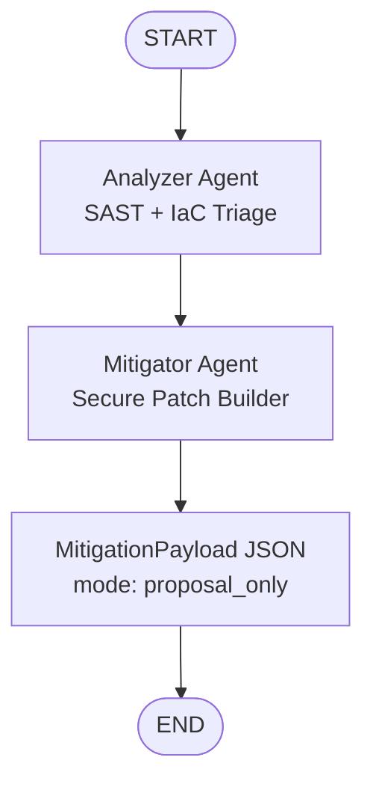

# Architecture

## Estado del grafo (`AgentState`)

`AgentState` acumula la evidencia de seguridad durante el flujo:

- `vulnerabilities: list[dict]`: hallazgos SAST/IaC detectados.
- `secure_patches: list[dict]`: parches seguros propuestos.
- `payload: dict | None`: propuesta final en JSON con `mode=proposal_only`.
- `messages: list[BaseMessage]`: trazas de diálogo y tool-calling.
- `errors: list[str]`: errores no fatales para auditoría.

## Flujo

1. `START` → `analyzer`
2. `analyzer` ejecuta escaneo de seguridad (tool-calling Ollama o fallback determinista).
3. `mitigator` transforma cada hallazgo en parche seguro (`propose_secure_patch`).
4. `mitigator` genera `MitigationPayload` y finaliza en `END`.

## Diagrama Mermaid.js

## Mantenibilidad

- Reglas de detección encapsuladas por herramienta (`scan_python_source`, `scan_dockerfile`, `scan_terraform_source`).
- Parches versionables por `rule_id` en `propose_secure_patch`.
- Estado estricto con validación Pydantic para evitar deriva de esquema.
