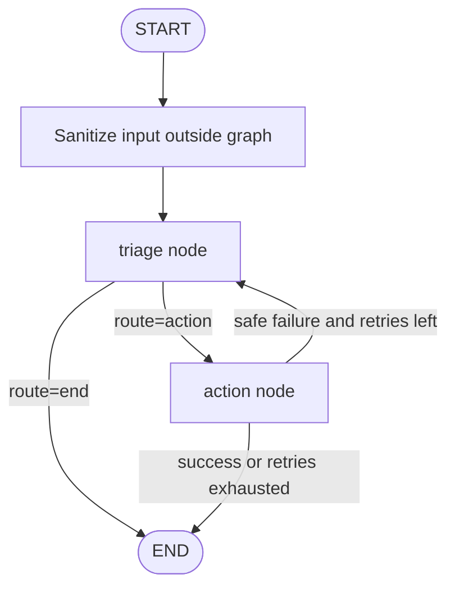

# Architecture

AgIA runs a `StateGraph` (LangGraph) with two agent nodes that share a typed state persisted by `MemorySaver` per `thread_id`.

## State

`AgentState` (TypedDict) holds:

| Field | Type | Description |
|---|---|---|
| `raw_input` | `str` | Original user input before sanitisation |
| `sanitized_input` | `str` | Input after normalisation and injection-pattern removal |
| `messages` | `list[BaseMessage]` | Append-only message log (`add_messages`) |
| `triage_plan` | `TriageDecision` | Structured output from the Triage agent |
| `action_report` | `ActionReport` | Structured output from the Action agent |
| `errors` | `list[str]` | Non-fatal error accumulator |
| `triage_attempts` | `int` | Retry counter for the feedback loop |
| `status` | `str` | Terminal state label (`completed` / `error`) |

## Nodes

### `triage`

- Consumes `sanitized_input`, `errors`, and `messages`.
- Produces a `TriageDecision` (CVE, IP, severity, strategy, rationale, `requires_action`, confidence).
- Protected against prompt injection because it only reads the sanitised version of the input.

### `action`

- Consumes `triage_plan`.
- Invokes an Ollama-backed model with a fixed set of allowed tools, or runs a deterministic safe fallback when Ollama is unavailable.
- Cannot alter state directly; returns a typed `ActionReport`.

## Edges

```
START → triage
triage → action          (when route == "action")
triage → END             (insufficient evidence or safe terminal condition)
action → triage          (safe failure, triage_attempts < MAX_TRIAGE_ATTEMPTS)
action → END             (success or retry budget exhausted)
```

## Flow diagram



## Feedback loop

The `action → triage` cycle activates only on a safe failure with `triage_attempts < 2`.  
A hard `recursion_limit=10` on the graph provides an additional backstop against infinite loops.

## Key design choices

- **Strict typing** — Pydantic v2 models for every structured exchange; `TypedDict` for the graph state.
- **Deterministic fallback** — the Action agent produces a safe, observable result even without an LLM, enabling testing without Ollama.
- **Minimal privilege tools** — `ToolRegistry` enumerates every callable tool; no shell or arbitrary-network access exists.
- **Stateless nodes** — nodes read state and return partial updates; they do not mutate the state object in-place.
