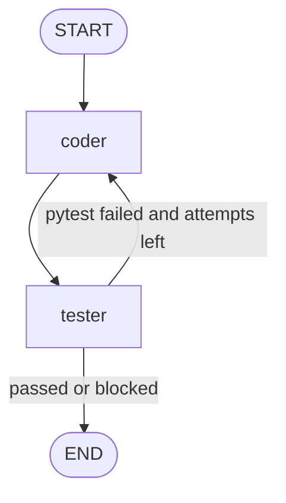

# Architecture

The function development pack runs a `StateGraph` with two nodes and a bounded self-correction loop persisted by `MemorySaver`.

## State

`AgentState` holds:

| Field | Type | Description |
|---|---|---|
| `request` | `FunctionRequest` | Validated function specification and inferred symbol name |
| `messages` | `list[BaseMessage]` | Append-only LangGraph message history |
| `attempt` | `int` | Current generation / validation round |
| `artifact` | `GeneratedArtifact \| None` | Latest generated code and pytest suite |
| `validation_report` | `ValidationReport \| None` | Latest validation outcome |
| `status` | `str` | `queued`, `drafted`, `retrying`, `completed`, or `failed` |

## Nodes

### `coder`

- Reads the validated request plus the latest pytest feedback.
- Uses two parallel Ollama calls to generate `subject.py` and `test_subject.py`.
- Stores both artifacts in one structured payload.

### `tester`

- Validates generated Python with AST checks before execution.
- Writes `subject.py` and `test_subject.py` into a temporary workspace.
- Runs `python -m pytest test_subject.py -q --maxfail=1` and captures STDOUT / STDERR.

## Edges

| From | To | Condition |
|---|---|---|
| `START` | `coder` | Initial entry |
| `coder` | `tester` | Always |
| `tester` | `coder` | Validation failed, no security block, and `attempt < 4` |
| `tester` | `END` | Validation passed, security blocked, or attempt budget exhausted |

## Flow diagram

## Correction loop

The self-correction loop is driven by the `validation_report.feedback` field. When pytest fails, the Tester agent stores the traceback summary in state and routes back to `coder`. The Coder agent receives the same function specification plus the latest failure report, regenerates both the implementation and the test suite, and sends a new artifact back to the Tester agent. The graph stops when pytest succeeds, a security control blocks execution, or the attempt budget is exhausted.

A hard `recursion_limit=8` is always supplied in the runtime config. With two nodes, that cap allows at most four coder/tester rounds and prevents infinite loops if the model keeps producing invalid code.
