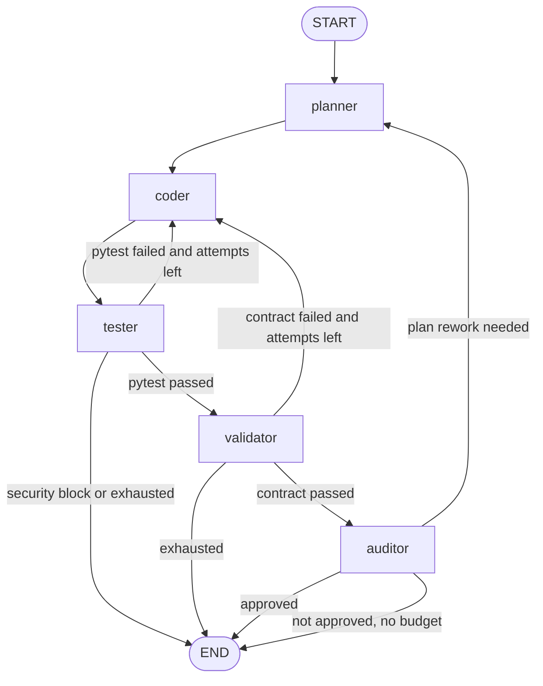

# Architecture

The function development pack runs a `StateGraph` with five nodes organised as a planning-coding-validation pipeline with an audit gate, persisted by `MemorySaver`.

## State

`AgentState` holds:

| Field | Type | Description |
|---|---|---|
| `request` | `FunctionRequest` | Validated function specification and inferred symbol name |
| `stack` | `str \| None` | Technology stack key (e.g. `"python"`, `"typescript"`) |
| `messages` | `list[BaseMessage]` | Append-only LangGraph message history |
| `attempt` | `int` | Current generation / validation round |
| `planner_attempts` | `int` | Current planning round |
| `plan_artifact` | `PlanArtifact \| None` | Plan, enriched spec, and acceptance criteria from Planner |
| `artifact` | `GeneratedArtifact \| None` | Latest generated code and pytest suite |
| `validation_report` | `ValidationReport \| None` | Latest pytest outcome |
| `contract_report` | `ContractReport \| None` | Latest semantic compliance check from Validator |
| `audit_report` | `AuditReport \| None` | Latest audit result from Auditor |
| `status` | `str` | `queued`, `planning`, `drafted`, `retrying`, `validating`, `auditing`, `completed`, or `failed` |

## Nodes

### `planner`

- Reads `request`, `stack`, and optional `audit_report` feedback.
- Loads stack-specific guidelines from `stacks/{stack}/` when a stack is provided.
- Produces a `PlanArtifact` with enriched specifications and acceptance criteria.
- Bounded by `MAX_PLANNER_ROUNDS=2`.

### `coder`

- Reads the `plan_artifact` (if present) to build an enriched specification.
- Combines pytest feedback (`validation_report`) and semantic feedback (`contract_report`) into a single correction prompt.
- Uses two parallel Ollama calls to generate `subject.py` and `test_subject.py`.

### `tester`

- Validates generated Python with AST checks before execution.
- Writes `subject.py` and `test_subject.py` into a temporary workspace.
- Runs `python -m pytest test_subject.py -q --maxfail=1` and captures STDOUT / STDERR.

### `validator`

- Receives the latest `artifact` and `plan_artifact`.
- Asks the LLM to check every acceptance criterion against the generated code.
- Produces a `ContractReport` with per-criterion pass/fail results and corrective feedback.

### `auditor`

- Reviews the plan, artifact, and contract report as a quality manager.
- Checks for best-practice violations and scope creep.
- Can request a plan rework (routes back to `planner`) or approve the deliverable (routes to `END`).

## Edges

| From | To | Condition |
|---|---|---|
| `START` | `planner` | Initial entry |
| `planner` | `coder` | Always |
| `coder` | `tester` | Always |
| `tester` | `validator` | Pytest passed |
| `tester` | `coder` | Pytest failed, no security block, `attempt < MAX_CORRECTION_ROUNDS` |
| `tester` | `END` | Security block or attempt budget exhausted |
| `validator` | `auditor` | Contract passed |
| `validator` | `coder` | Contract failed and `attempt < MAX_CORRECTION_ROUNDS` |
| `validator` | `END` | Attempt budget exhausted |
| `auditor` | `END` | Approved |
| `auditor` | `planner` | Plan rework required and `planner_attempts < MAX_PLANNER_ROUNDS` |
| `auditor` | `END` | Not approved but no rework budget left |

## Flow diagram

## Correction loops

### Coder / Tester loop

Activated when pytest fails and `attempt < MAX_CORRECTION_ROUNDS=4`. Feedback from both the pytest run and the most recent contract report are combined into the correction prompt.

### Coder / Validator loop

Activated when the Validator finds unmet acceptance criteria and `attempt < MAX_CORRECTION_ROUNDS=4`. The Coder receives the failed criteria as semantic feedback.

### Planner / Auditor loop

Activated when the Auditor sets `requires_plan_rework=True` and `planner_attempts < MAX_PLANNER_ROUNDS=2`. The Auditor's feedback is injected into the next Planner invocation.

A hard `recursion_limit=25` is always supplied in the runtime config as a backstop against infinite loops.

## Key design choices

- **Strict typing** — Pydantic v2 models for every structured exchange; `TypedDict` for the graph state.
- **Stack-aware planning** — The Planner reads technology-specific guidelines from `stacks/` before producing acceptance criteria.
- **Dual feedback loop** — The Coder receives both pytest output and semantic compliance failures in the same correction prompt.
- **Deterministic fallback** — All Ollama-backed agents fall back to passthrough implementations when the LLM is unavailable, enabling testing without Ollama.
- **Stateless nodes** — Nodes read state and return partial updates; they do not mutate the state object in-place.
