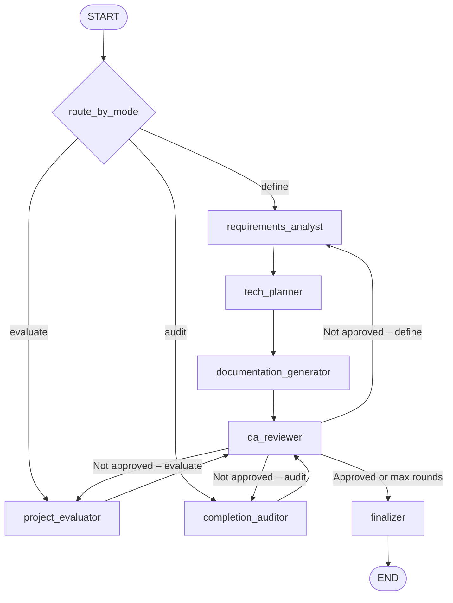

# Architecture

The pack executes a mode-driven multi-agent pipeline in LangGraph and produces one Markdown master document.

## State

`LifecycleState` contains:

| Field | Type | Description |
|---|---|---|
| `project_description` | `str` | Input project brief from the operator |
| `mode` | `str` | Operating mode: `define`, `evaluate`, or `audit` |
| `scaffold_requested` | `bool` | Whether to include directory scaffolding in `define` output |
| `messages` | `list[BaseMessage]` | Full conversation history for checkpoint traceability |
| `round_number` | `int` | Completed QA review rounds |
| `max_rounds` | `int` | Hard cap for QA iterations (1–3) |
| `requirements_doc` | `str` | Requirements analysis output (`define`) |
| `tech_plan_doc` | `str` | Technology proposal and plan output (`define`) |
| `documentation_outline` | `str` | Documentation/scaffolding outline output (`define`) |
| `evaluation_doc` | `str` | Evaluation report output (`evaluate`) |
| `audit_doc` | `str` | Completion audit output (`audit`) |
| `qa_review_doc` | `str` | Latest QA review |
| `qa_approved` | `bool` | QA approval gate |
| `review_log` | `list[dict]` | Round-by-round QA evidence |
| `final_document` | `str` | Unified final Markdown output |
| `errors` | `list[str]` | Non-fatal fallback warnings |

## Agent chains by mode

### `define` mode

```text
START → requirements_analyst → tech_planner → documentation_generator → qa_reviewer
```

When QA does not approve and rounds remain, the loop restarts from `requirements_analyst` with QA feedback incorporated.

### `evaluate` mode

```text
START → project_evaluator → qa_reviewer
```

When QA does not approve and rounds remain, `project_evaluator` reruns with QA feedback.

### `audit` mode

```text
START → completion_auditor → qa_reviewer
```

When QA does not approve and rounds remain, `completion_auditor` reruns with QA feedback.

## QA loop and consensus

1. The QA reviewer audits the current mode's output and returns an approval decision.
2. If not approved and `round_number < max_rounds`, the graph loops back to the primary analysis node.
3. When `round_number >= max_rounds`, the output is auto-approved to guarantee termination.
4. `finalizer` assembles the complete Markdown report from all state fields.

## Edges

```text
START → route_by_mode → {requirements_analyst | project_evaluator | completion_auditor}

requirements_analyst → tech_planner → documentation_generator → qa_reviewer
project_evaluator → qa_reviewer
completion_auditor → qa_reviewer

qa_reviewer → route_after_qa → {requirements_analyst | project_evaluator | completion_auditor | finalizer}
finalizer → END
```

## Workflow diagram (Mermaid)


